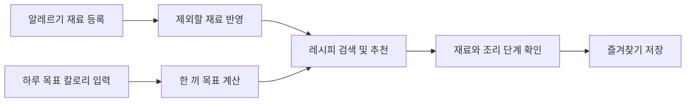
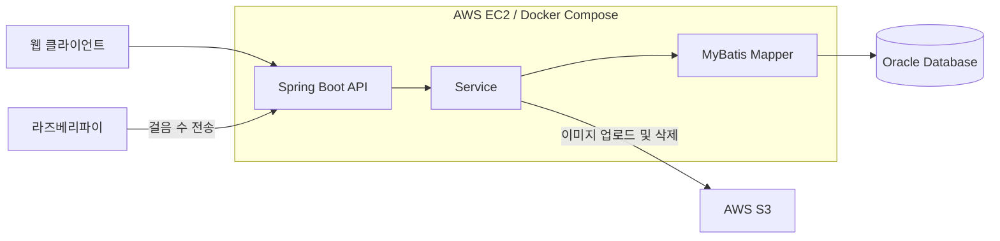
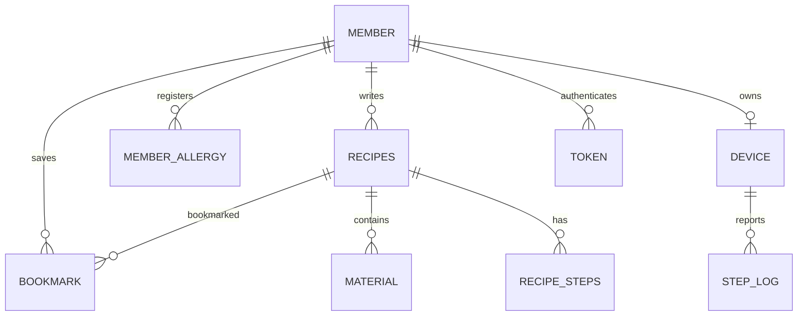

<div align="center">

# Allergy Out

**알레르기 재료를 제외하고, 목표 칼로리에 맞는 레시피를 찾는 서비스**

Back-end Repository


[백엔드 저장소](https://github.com/lno001/allergy-out-BE) · [실행 방법](docs/SETUP.md) · [DB 설명](db/README.md)

**개발 기간:** 추후 기입

</div>

## 소개

Allergy Out은 개인의 알레르기 정보와 목표 칼로리를 고려해 레시피를 탐색할 수 있는 서비스입니다. 사용자는 피해야 할 재료를 등록하고, 해당 재료가 포함된 레시피를 검색 결과에서 제외할 수 있습니다.

이 저장소는 회원 인증, 레시피 검색·작성·추천, 즐겨찾기, 라즈베리파이 걸음 수 기록을 처리하는 백엔드 API를 제공합니다.

## 서비스 흐름



<!-- 실제 서비스 화면을 준비한 뒤 이 위치에 레시피 목록, 상세, 마이페이지 이미지를 추가합니다. -->

### 주요 기능

| 기능 | 구현 내용 |
| --- | --- |
| 알레르기 필터링 | 개인별 알레르기 재료를 저장하고 레시피 목록·추천에 반영 |
| 레시피 검색 | 제목 검색, 재료 제외, 음식 종류·조리 방법 필터, 최신순·조회수순 정렬 |
| 레시피 추천 | 날짜 기반 오늘의 추천, 하루 목표 칼로리를 기준으로 한 추천 |
| 레시피 공유 | 대표 이미지, 재료, 조리 단계, 영양 정보를 포함한 레시피 등록·수정·삭제 |
| 즐겨찾기 | 관심 있는 레시피 등록·해제 및 내 즐겨찾기 조회 |
| 회원 관리 | 회원가입·로그인, 토큰 재발급, 회원 정보와 프로필 이미지 변경, 회원 탈퇴 |
| 활동 기록 | 라즈베리파이 등록, 누적 걸음 수 저장, 오늘 및 최근 7일 기록 조회 |

### 알레르기 필터링

회원의 알레르기 재료와 레시피의 재료명을 비교해 검색 결과에서 제외합니다. 재료명에 해당 단어가 포함되는지도 비교하므로, `땅콩`을 등록하면 `땅콩버터`가 들어간 레시피도 제외됩니다.

비로그인 상태에서도 레시피를 조회할 수 있습니다. 로그인 후 인증 토큰을 보내면 내 알레르기 필터가 기본 적용되며, 목록에서 즐겨찾기 여부도 확인할 수 있습니다. 목록과 날짜 기반 추천에서는 `applyMyAllergy=false`로 개인 필터를 해제할 수 있습니다.

### 칼로리 기반 추천

프런트엔드에서 전달한 하루 목표 칼로리를 3으로 나누어 한 끼 목표를 계산합니다. 회원의 알레르기 재료를 제외한 뒤, 한 끼 목표와 칼로리 차이가 작은 레시피를 최대 3개 추천합니다.

```text
하루 목표 2,100 kcal → 한 끼 목표 700 kcal
→ 알레르기 재료가 포함된 레시피 제외
→ 700 kcal에 가까운 레시피 최대 3개 추천
```

칼로리 정보가 없는 레시피는 칼로리 추천에서 제외하며, 조건에 맞는 후보가 없으면 빈 목록을 반환합니다.

## API

서버 실행 후 [Swagger UI](http://localhost:8080/swagger-ui/index.html)에서 API 목록과 요청·응답 구조를 확인할 수 있습니다. JSON 형식의 명세는 [OpenAPI 문서](http://localhost:8080/v3/api-docs)에서 제공합니다. 두 주소는 기본 포트 `8080`의 로컬 실행 기준입니다.

| 구분 | 대표 경로 | 기능 |
| --- | --- | --- |
| 인증 | `/api/auth` | 회원가입, 로그인, 로그아웃, 토큰 재발급 |
| 회원 | `/api/members` | 회원 정보, 프로필 이미지, 알레르기 관리 |
| 레시피 | `/api/recipes` | 검색, 상세 조회, 등록·수정·삭제 |
| 추천 | `/api/recipes/recommend` | 날짜 기반 추천 |
| 칼로리 추천 | `/api/recipes/recommend/calorie` | 목표 칼로리 기반 추천 |
| 즐겨찾기 | `/api/bookmarks` | 즐겨찾기 등록·해제·조회 |
| 활동 기록 | `/api/rasp` | 디바이스 등록 및 걸음 수 저장·조회 |

인증이 필요한 API에는 `Authorization: Bearer <accessToken>` 헤더를 사용합니다. Refresh Token은 HttpOnly 쿠키로 전달하며, 로그인 및 재발급 요청에서는 클라이언트의 쿠키 전송 설정이 필요합니다.

## 기술 스택

### Back-end

| 기술 | 사용 내용 |
| --- | --- |
| Java 21 / Spring Boot 4.0.8 | 백엔드 애플리케이션 |
| Spring Web MVC | REST API 및 요청 처리 |
| Spring Security / JJWT | 회원 인증, JWT 발급·검증, API 접근 권한 |
| MyBatis Spring Boot Starter 4.0.1 / Spring JDBC | SQL 매퍼를 통한 DB 조회·저장 |
| Oracle Database | 회원, 레시피, 즐겨찾기, 활동 기록 저장 |
| Jakarta Validation | 요청값 검증 |
| springdoc-openapi | Swagger API 문서 |

### Infra

| 기술 | 사용 내용 |
| --- | --- |
| AWS EC2 | 백엔드 배포 서버 |
| AWS S3 | 회원 프로필, 레시피 대표 이미지, 조리 단계 이미지 저장 |
| Docker Compose | 배포 서버의 백엔드 컨테이너 실행 관리 |
| GitHub Actions | 빌드·테스트 및 배포 자동화 |
| Actuator / Micrometer Prometheus | 상태 확인과 메트릭 제공을 위한 의존성 구성 |

### Tools & Test

| 기술 | 사용 내용 |
| --- | --- |
| Git / GitHub | 소스 코드 관리 |
| Gradle Wrapper | 빌드 및 테스트 실행 |
| JUnit Jupiter / Mockito | 서비스 로직과 예외 처리 테스트 |
| Spring MVC Test | API 요청값과 파일 업로드 폼 바인딩 테스트 |

## 프로젝트 아키텍처



Controller는 요청을 받고, Service는 기능을 처리하며, Mapper는 SQL을 실행합니다. Oracle 노드는 데이터 저장소를 나타내며 DB의 설치 위치를 의미하지 않습니다.

### 배포 흐름

```text
main 대상 PR → GitHub Actions에서 빌드·테스트
main에 push → 빌드·테스트 → 실행 JAR를 EC2로 전송 → backend 컨테이너 재시작
```

현재 워크플로는 실행 JAR를 `/home/ubuntu/app`에 전송하고 `docker compose restart backend`를 실행합니다. 서버에는 해당 JAR를 사용하는 Compose 설정이 별도로 필요합니다.

### DB 관계



회원과 레시피의 즐겨찾기는 `BOOKMARK` 테이블로 연결합니다. 재료와 조리 단계는 레시피별로 여러 건을 저장하고, 디바이스는 회원당 1개만 등록할 수 있습니다. SQL 파일의 역할과 실행 순서는 [DB 설명](db/README.md)에 정리했습니다.

### 코드 구조

```text
src/main/java/com/allergyout/
  auth/        # 회원가입, 로그인, 토큰
  member/      # 회원 정보와 프로필
  allergy/     # 개인별 알레르기 재료
  recipe/      # 레시피 작성, 검색, 추천
  bookmark/    # 즐겨찾기
  rasp/        # 디바이스와 걸음 수
  s3/          # 이미지 업로드와 삭제
  admin/       # 관리자 기능 기반 코드
  global/      # 공통 응답, 예외, 보안, 암호화, 설정
src/main/resources/mapper/   # MyBatis SQL
src/test/java/com/allergyout/ # 테스트
```

`admin` 패키지는 있으나 현재 컨트롤러에 개별 관리자 API는 구현되어 있지 않습니다.

## 기술적 과제와 구현

실제 코드에 반영된 처리 방법을 정리했습니다.

### 1. 검색어의 특수문자 처리

SQL의 `LIKE`에서 `%`와 `_`는 일반 글자가 아니라 검색 범위를 넓히는 문자로 동작합니다. 사용자가 이 문자를 입력했을 때 의도와 다르게 검색되지 않도록 서비스에서 이스케이프하고, 매퍼에 `ESCAPE` 조건을 적용했습니다.

관련 코드: [RecipeService](https://github.com/lno001/allergy-out-BE/blob/main/src/main/java/com/allergyout/recipe/model/service/RecipeService.java), [recipe-mapper.xml](https://github.com/lno001/allergy-out-BE/blob/main/src/main/resources/mapper/recipe-mapper.xml)

### 2. 조리 단계 순서 변경 시 중복 방지

같은 레시피 안에서는 조리 순서가 중복될 수 없도록 UNIQUE 조건을 사용합니다. 순서를 바로 맞바꾸면 중간 과정에서 같은 번호가 생길 수 있어, 남아 있는 기존 단계의 순서에 임시로 1,000을 더한 뒤 요청한 최종 순서로 수정합니다. 이 과정은 하나의 DB 트랜잭션 안에서 처리합니다.

관련 코드: [RecipeService의 updateSteps](https://github.com/lno001/allergy-out-BE/blob/main/src/main/java/com/allergyout/recipe/model/service/RecipeService.java)

### 3. DB 저장과 S3 이미지 처리

DB 작업을 취소해도 이미 업로드된 S3 파일이 자동으로 삭제되지는 않습니다. 레시피 등록·수정 서비스에서 처리 중 예외를 잡으면 새로 업로드한 이미지 삭제를 시도합니다. 교체된 기존 이미지는 DB 커밋이 성공한 뒤 삭제하도록 처리했습니다.

이미지 삭제 자체가 실패한 경우에는 확인할 수 있도록 로그를 남깁니다. 삭제 실패에 대한 자동 재시도는 현재 구현되어 있지 않습니다.

관련 코드: [RecipeService](https://github.com/lno001/allergy-out-BE/blob/main/src/main/java/com/allergyout/recipe/model/service/RecipeService.java), [S3Service](https://github.com/lno001/allergy-out-BE/blob/main/src/main/java/com/allergyout/s3/S3Service.java)

## 실행 및 테스트

JDK 21, Oracle 접속 정보와 테이블, AWS S3 설정, JWT·암호화 키가 필요합니다. 설정 예시와 실행 순서는 [로컬 실행 안내](docs/SETUP.md)를 참고하세요.

| 작업 | Windows PowerShell | macOS / Linux |
| --- | --- | --- |
| 서버 실행 | `.\gradlew.bat bootRun` | `./gradlew bootRun` |
| 테스트 | `.\gradlew.bat test` | `./gradlew test` |
| 빌드 | `.\gradlew.bat clean build` | `./gradlew clean build` |

회원·알레르기·레시피·즐겨찾기·걸음 수 서비스와 이미지 검증, 암호화, 요청값 검증 테스트가 포함되어 있습니다. 테스트 보고서는 `build/reports/tests/test/index.html`, 실행 JAR는 `build/libs/`에 생성됩니다.

## 프로젝트 팀원

<!-- 이름, GitHub 주소, 실제 담당 기능은 추후 기입합니다. 필요한 만큼 행을 추가합니다. -->

| 이름 | GitHub | 담당 역할 |
| --- | --- | --- |
| 추후 기입 | 추후 기입 | 추후 기입 |

---

README 구성 참고: [yewon-Noh/readme-template의 백엔드 템플릿](https://github.com/yewon-Noh/readme-template/tree/main/backend)
